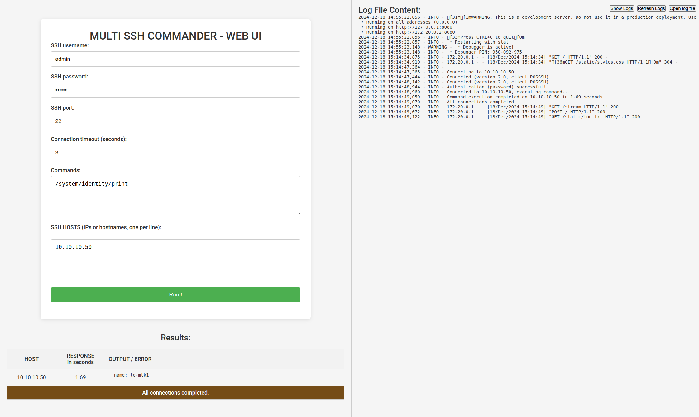

# multi-ssh-commander

A tool that allows you to run commands sequentially on specified ssh targets.
Python script with a web interface.

~~Demo at: https://multi-ssh-commander.fly.dev~~

~~!!! ALL IPS ARE STORED IN PUBLICLY ACCESSIBLE LOG, DO NOT USE FOR REAL CONNECTIONS, USE AT YOUR OWN RISK !!!~~



# Start in Docker from dockerhub

```
docker run -d --name multisshcommander -p 8000:8080 robinpecha/dockerhub:multisshcommander
```

Then open http://localhost:8080/ in your browser

# Download, build and start (Linux)

### Clone / download this repo

```
# clone repo:

git clone https://github.com/robinpecha/multi-ssh-commander.git

# or download and unpack zip file:

wget https://github.com/robinpecha/multi-ssh-commander/archive/refs/heads/main.zip
unzip main.zip 
mv multi-ssh-commander-main multi-ssh-commander
rm main.zip
```

### Jump to directory

```
cd multi-ssh-commander
```

### Start container or run script localy

Or start docker container with app:
```
docker compose up -d
```

To start script localy, install requirements and run script:
**CAUTION, this was not really tested, take care about known_hosts and user rights by yourself!**
```
pip install --no-cache-dir -r requirements.txt
python multisshcommander.py
```

### Open http://localhost:8080/ in your browser
