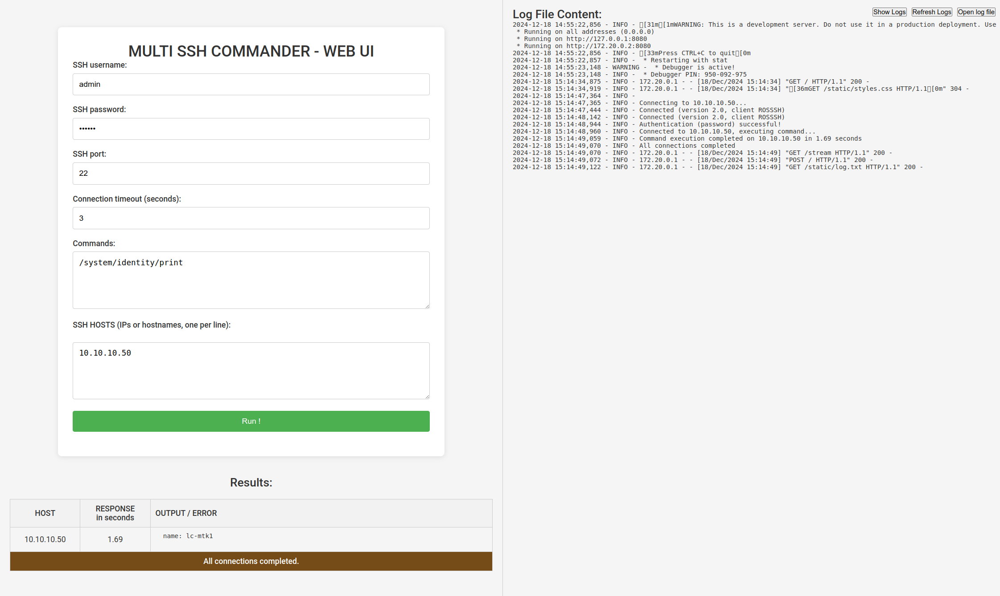

# multi-ssh-commander
A tool that allows you to run commands sequentially on specified ssh targets. Simple python script with a web interface.

**Features:**
- Execute commands on multiple SSH hosts sequentially
- Support for both **password** and **SSH key** authentication
- Upload SSH keys or use existing ones from filesystem
- **Per-host custom port specification** (e.g., `192.168.1.1:2222`)
- Real-time output streaming
- Connection logging and monitoring

<ins>**THIS IS AN UNSTABLE DEVELOPMENT VERSION, USE IT AT YOUR OWN RISK.**</ins>
>I strongly recommend opening a side panel with logs to monitor whole process. HTML listing at the bottom can be not so accurate.




# Start in Docker from dockerhub

```
docker run -d --name multisshcommander -p 8080:8080 robinpecha/dockerhub:multisshcommander
```

Then open http://localhost:8080/ in your browser

# Download, build and start (Linux)

### Clone / download this repo

```
# clone repo:

git clone https://github.com/robinpecha/multi-ssh-commander.git

# or download and unpack zip file:

wget https://github.com/robinpecha/multi-ssh-commander/archive/refs/heads/main.zip
unzip main.zip 
mv multi-ssh-commander-main multi-ssh-commander
rm main.zip
```

### Jump to directory

```
cd multi-ssh-commander
```

### Start container or run script localy

Or start docker container with app:
```
docker compose up -d --force-recreate
```

To start script localy, install requirements and run script:
**CAUTION, this was not really tested, take care about known_hosts and user rights by yourself!**
```
pip install --no-cache-dir -r requirements.txt
python multisshcommander.py
```

### Open http://localhost:8080/ in your browser

## Authentication Methods

The tool supports two authentication methods:

### Password Authentication
Select "Password" from the authentication method dropdown and enter your SSH password.

### SSH Key Authentication
Select "SSH Key" from the authentication method dropdown. You have three options:

1. **Use default SSH keys**: Leave the key path empty, and the tool will look for keys in `~/.ssh/` (id_rsa, id_dsa, id_ecdsa, id_ed25519)

2. **Specify key path**: Enter the full path to your private key file (e.g., `~/.ssh/id_rsa` or `/home/user/.ssh/mykey.pem`)

3. **Upload key file**: Use the file upload button to upload your private key file. The file will be securely stored in `~/.ssh/uploaded_keys/` with proper permissions (600)

If your private key is encrypted, enter the passphrase in the "Key Passphrase" field.

**Security Note**: Uploaded keys are stored on the server. For production use, consider using key paths or mounting keys via Docker volumes instead of uploading.

## Host Configuration

### Default SSH Port
The "Default SSH port" field sets the port for all hosts. This is typically `22` but can be changed (e.g., to `11111`) to apply to all listed hosts.

### Per-Host Custom Ports
You can override the default port for specific hosts by using the `host:port` format in the hosts list:

```
192.168.1.1
192.168.1.2:2222
example.com:11111
10.0.0.5
```

In this example:
- `192.168.1.1` and `10.0.0.5` will use the default port
- `192.168.1.2` will use port `2222`
- `example.com` will use port `11111`


### UN-LICENSE

This is free and unencumbered software released into the public domain.

Anyone is free to copy, modify, publish, use, compile, sell, or
distribute this software, either in source code form or as a compiled
binary, for any purpose, commercial or non-commercial, and by any
means.

In jurisdictions that recognize copyright laws, the author or authors
of this software dedicate any and all copyright interest in the
software to the public domain. We make this dedication for the benefit
of the public at large and to the detriment of our heirs and
successors. We intend this dedication to be an overt act of
relinquishment in perpetuity of all present and future rights to this
software under copyright law.

THE SOFTWARE IS PROVIDED "AS IS", WITHOUT WARRANTY OF ANY KIND,
EXPRESS OR IMPLIED, INCLUDING BUT NOT LIMITED TO THE WARRANTIES OF
MERCHANTABILITY, FITNESS FOR A PARTICULAR PURPOSE AND NONINFRINGEMENT.
IN NO EVENT SHALL THE AUTHORS BE LIABLE FOR ANY CLAIM, DAMAGES OR
OTHER LIABILITY, WHETHER IN AN ACTION OF CONTRACT, TORT OR OTHERWISE,
ARISING FROM, OUT OF OR IN CONNECTION WITH THE SOFTWARE OR THE USE OR
OTHER DEALINGS IN THE SOFTWARE.

For more information, please refer to <https://unlicense.org>
